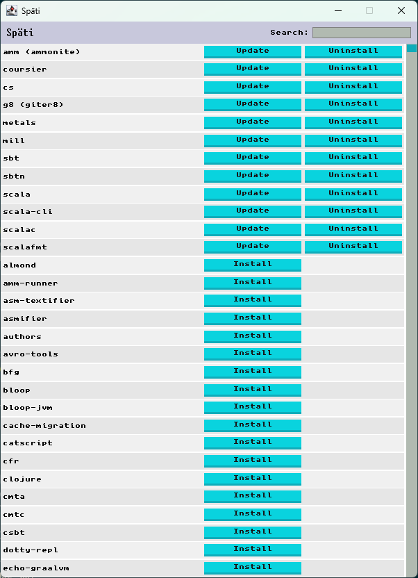

# Späti

A store where you can get all your favorite [Coursier](https://get-coursier.io/)  packages.

## What is Späti

Späti is a GUI for [Coursier](https://get-coursier.io/).

You can use it to install, update and delete packages.

The current version is still very limited and does not support any configuration,
fetching applications from both the default `apps` and `apps-contrib` channels.

## Installing

Install it with Coursier using `cs install --contrib spaeti`, then run it with `spaeti`.

## Acknowledgments

Font: [Unscii](http://viznut.fi/unscii/) by [Viznut](http://viznut.fi/)
